<<<<<<< HEAD
# 🚀 Infraestructura Multimodulo - Spring Boot + React + Azure

Infraestructura como código (IaC) para desplegar una aplicación multimodulo con backend Spring Boot y frontend React en Azure usando Terraform y GitHub Actions.

## 📋 Arquitectura

```
┌─────────────────────────────────────────────────────────────┐
│                    Application Gateway                       │
│                    (HTTPS Termination)                       │
└────────────┬────────────────────────┬───────────────────────┘
             │                        │
    ┌────────▼────────┐      ┌───────▼────────┐
    │  Spring Boot    │      │   React App    │
    │  (Backend API)  │◄─────┤   (Frontend)   │
    │   Java 17       │      │   Node 20.x    │
    └────────┬────────┘      └────────────────┘
             │
    ┌────────▼────────┐
    │  Azure SQL DB   │
    │   (Database)    │
    └─────────────────┘
```

### Componentes

- **Backend**: Spring Boot multimodulo (Customers + Orders)
- **Frontend**: React SPA
- **Base de datos**: Azure SQL Database
- **Red**: Virtual Network con subnets privadas
- **Seguridad**: Key Vault + Private Endpoints
- **Gateway**: Application Gateway con SSL
- **Monitoreo**: Application Insights + Log Analytics

## 📁 Estructura del Proyecto

```
infrastructure-multimodulo/
├── .github/
│   └── workflows/
│       ├── plan.yaml              # Terraform plan (PR preview)
│       ├── apply.yaml             # Terraform apply (deploy infra)
│       ├── deploy-backend.yml     # Deploy Spring Boot
│       ├── deploy-frontend.yml    # Deploy React
│       └── deploy-database.yml    # Deploy SQL migrations
├── infra/
│   └── main/
│       ├── main.tf                # Configuración Terraform
│       └── variables.tf           # Variables
├── database/
│   ├── migrations/
│   │   └── 001_create_tables.sql # Schema inicial
│   └── seeds/
│       └── 001_seed_data.sql     # Datos iniciales
└── README.md
```

## 🚀 Inicio Rápido

### Pre-requisitos

1. **Cuenta de Azure** con permisos de Contributor
2. **Repositorios de código**:
   - Backend: `jgonzaloDev/BACKEND_SPRING_MULTIMODULO`
   - Frontend: `jgonzaloDev/FRONT_REAC_DOJO`
3. **GitHub Personal Access Token** con permisos de repo
4. **Service Principal OIDC** configurado en Azure

### Paso 1: Configurar Identidad Federada (OIDC)

```bash
# 1. Crear App Registration en Azure AD
az ad app create --display-name "GitHub-Actions-OIDC"

# 2. Obtener el Application (client) ID
APP_ID=$(az ad app list --display-name "GitHub-Actions-OIDC" --query "[0].appId" -o tsv)

# 3. Crear Service Principal
az ad sp create --id $APP_ID

# 4. Obtener Object ID del Service Principal
OBJECT_ID=$(az ad sp list --filter "appId eq '$APP_ID'" --query "[0].id" -o tsv)

# 5. Asignar rol Contributor
az role assignment create \
  --assignee $APP_ID \
  --role Contributor \
  --scope /subscriptions/YOUR_SUBSCRIPTION_ID

# 6. Configurar credencial federada
az ad app federated-credential create \
  --id $APP_ID \
  --parameters '{
    "name": "GitHubActions",
    "issuer": "https://token.actions.githubusercontent.com",
    "subject": "repo:TU_USUARIO/TU_REPO:ref:refs/heads/main",
    "audiences": ["api://AzureADTokenExchange"]
  }'
```

### Paso 2: Configurar Secrets en GitHub

Ve a `Settings` > `Secrets and variables` > `Actions` y agrega:

#### Autenticación Azure
- `AZURE_CLIENT_ID` - Application (client) ID
- `AZURE_SUBSCRIPTION_ID` - ID de tu suscripción
- `AZURE_TENANT_ID` - Tenant ID

#### Configuración de Infraestructura
- `TF_VAR_LOCATION` - eastus2
- `TF_VAR_RESOURCE_GROUP_NAME` - rg-multimodulo-prod
- `TF_VAR_VNET_NAME` - vnet-multimodulo
- `TF_VAR_SQL_SERVER_NAME` - sql-multimodulo-prod
- `TF_VAR_DATABASE_NAME` - dbMultimodulo
- `TF_VAR_SQL_ADMIN_LOGIN` - sqladmin
- `TF_VAR_SQL_ADMIN_PASSWORD` - [contraseña fuerte]
- `TF_VAR_APP_SERVICE_PLAN_NAME` - asp-backend-multimodulo
- `TF_VAR_APP_SERVICE_PLAN_NAME_WEB` - asp-frontend-multimodulo
- `TF_VAR_APP_SERVICE_NAME` - app-backend-multimodulo
- `TF_VAR_APP_SERVICE_NAME_WEB` - app-frontend-multimodulo
- `TF_VAR_KEY_VAULT_NAME` - kv-multimodulo-prod
- `TF_VAR_STORAGE_ACCOUNT_NAME` - stmultimoduloprod
- `TF_VAR_ADMIN_USER_OBJECT_ID` - Tu Object ID en Azure AD
- `TF_VAR_GITHUB_PRINCIPAL_ID` - Object ID del Service Principal
- `TF_VAR_ENABLE_ELASTIC` - false (o true si usas Elasticsearch)

#### Certificado SSL (Opcional)
- `TF_VAR_CERT_DATA` - Certificado en base64
- `TF_VAR_CERT_PASSWORD` - Contraseña del certificado

#### GitHub
- `GH_PERSONAL_TOKEN` - Token para clonar repos privados

### Paso 3: Desplegar Infraestructura

```bash
# 1. Clonar este repositorio
git clone https://github.com/TU_USUARIO/infrastructure-multimodulo.git
cd infrastructure-multimodulo

# 2. Crear estructura de carpetas
mkdir -p infra/main database/migrations database/seeds .github/workflows

# 3. Push a GitHub
git add .
git commit -m "Initial infrastructure setup"
git push origin main
```

**En GitHub Actions:**

1. Ve a `Actions` > `Terraform Apply – MAIN Infra`
2. Click `Run workflow`
3. Espera ~10 minutos mientras se crea la infraestructura

### Paso 4: Desplegar Base de Datos

1. Ve a `Actions` > `Deploy Database Migrations`
2. Click `Run workflow`
3. Esto creará las tablas e insertará datos iniciales

### Paso 5: Desplegar Aplicaciones

**Backend:**
1. Ve a `Actions` > `Deploy Backend (Spring Boot App)`
2. Click `Run workflow`

**Frontend:**
1. Ve a `Actions` > `Deploy Frontend (React)`
2. Click `Run workflow`

### Paso 6: Verificar Despliegue

```bash
# Obtener URL del Application Gateway
az network public-ip show \
  --resource-group rg-multimodulo-prod \
  --name appgw-public-ip \
  --query ipAddress -o tsv

# Probar endpoints
curl https://[APP_GATEWAY_IP]/api/customers
curl https://[APP_GATEWAY_IP]/
```

## 🏗️ Workflows Disponibles

### 1. `plan.yaml` - Vista Previa de Cambios
- **Trigger**: Pull Request a `main`
- **Propósito**: Ver qué cambiará antes de aplicar
- **No modifica** recursos en Azure

### 2. `apply.yaml` - Desplegar Infraestructura
- **Trigger**: Manual (workflow_dispatch)
- **Propósito**: Crear/actualizar recursos en Azure
- **Duración**: ~10 minutos

### 3. `deploy-database.yml` - Migraciones SQL
- **Trigger**: Manual
- **Propósito**: Ejecutar scripts SQL en Azure SQL DB
- **Features**:
  - Validación de scripts
  - Backup automático (en main)
  - Seeds solo en develop
  - Firewall temporal

### 4. `deploy-backend.yml` - Deploy Spring Boot
- **Trigger**: Push a main/develop o manual
- **Propósito**: Compilar y desplegar backend Java
- **Process**:
  1. Clona repo de backend
  2. Maven build
  3. Deploy JAR a App Service
  4. Health check

### 5. `deploy-frontend.yml` - Deploy React
- **Trigger**: Push a main/develop o manual
- **Propósito**: Compilar y desplegar frontend
- **Process**:
  1. Clona repo de frontend
  2. npm build
  3. Deploy a App Service
  4. Verificación

## 🔐 Seguridad

### Private Endpoints
Todos los recursos tienen private endpoints:
- ✅ Backend App Service
- ✅ Frontend App Service
- ✅ SQL Server
- ✅ Key Vault
- ✅ Storage Account

### Key Vault
Las credenciales se almacenan en Key Vault:
- `db-database` - Nombre de la base de datos
- `db-username` - Usuario SQL
- `db-password` - Contraseña SQL

### Managed Identity
Los App Services usan Managed Identity para acceder a Key Vault sin credenciales hardcodeadas.

## 📊 Monitoreo

### Application Insights
- Telemetría de aplicaciones
- Performance monitoring
- Error tracking
- Custom metrics

### Log Analytics
- Logs centralizados
- Query con KQL
- Alertas personalizadas

## 🔄 CI/CD Flow

```mermaid
graph LR
    A[Código] --> B[GitHub Push]
    B --> C[GitHub Actions]
    C --> D{Workflow}
    D -->|Infra| E[Terraform Apply]
    D -->|Backend| F[Maven Build]
    D -->|Frontend| G[npm Build]
    D -->|DB| H[SQL Scripts]
    E --> I[Azure Resources]
    F --> J[App Service Backend]
    G --> K[App Service Frontend]
    H --> L[SQL Database]
```



## 🛠️ Comandos Útiles

### Terraform Local

```bash
cd infra/main

# Inicializar
terraform init

# Ver plan
terraform plan

# Aplicar cambios
terraform apply

# Destruir (¡CUIDADO!)
terraform destroy
```

### Azure CLI

```bash
# Ver recursos
az resource list \
  --resource-group rg-multimodulo-prod \
  --output table

# Ver logs del backend
az webapp log tail \
  --name app-backend-multimodulo \
  --resource-group rg-multimodulo-prod

# Conectar a SQL
sqlcmd -S sql-multimodulo-prod.database.windows.net \
  -d dbMultimodulo \
  -U sqladmin \
  -P [password]
```

## 🐛 Troubleshooting

### Error: "Backend storage doesn't exist"
El workflow crea el storage backend automáticamente. Verifica permisos del Service Principal.

### Error: "Name already exists"
Algunos recursos requieren nombres únicos globalmente. Agrega un sufijo único en los secrets.

### Error: "Unauthorized"
Verifica que el Service Principal tenga el rol "Contributor" en la suscripción.

### Backend no arranca
1. Verifica los logs: `az webapp log tail`
2. Revisa variables de entorno en App Service
3. Verifica conexión a SQL desde Key Vault

### Frontend muestra error de CORS
Verifica que `REACT_APP_API_URL` apunte al backend correcto.

## 📚 Recursos

- [Spring Boot Docs](https://spring.io/projects/spring-boot)
- [React Docs](https://react.dev/)
- [Terraform Azure Provider](https://registry.terraform.io/providers/hashicorp/azurerm/latest/docs)
- [Azure App Service](https://docs.microsoft.com/azure/app-service/)
- [GitHub Actions](https://docs.github.com/actions)

## 👥 Contribuir

1. Fork el proyecto
2. Crea una rama (`git checkout -b feature/nueva-feature`)
3. Commit tus cambios (`git commit -m 'Añadir nueva feature'`)
4. Push a la rama (`git push origin feature/nueva-feature`)
5. Abre un Pull Request

## 📄 Licencia

Este proyecto está bajo la Licencia MIT.

---

**Hecho con ❤️ para proyectos multimodulo en Azure**
=======
# Infraestructura Etapa 4 - Observabilidad con OpenTelemetry

Este proyecto contiene la infraestructura como código (IaC) para desplegar una aplicación completa en Azure con observabilidad integrada usando OpenTelemetry, Application Insights y opcionalmente Elasticsearch/Kibana.

## 🏗️ Arquitectura

### Componentes principales:

1. **Frontend (React)** - App Service Linux con Node.js
2. **Backend (Spring Boot)** - App Service Linux con Java 17
3. **OpenTelemetry Collector** - Container Instance para recolección de trazas y logs
4. **Azure Monitor + Application Insights** - Observabilidad nativa de Azure
5. **Elasticsearch + Kibana** (Opcional) - Stack alternativo de observabilidad
6. **SQL Server** - Base de datos
7. **Key Vault** - Gestión de secretos
8. **Storage Account** - Almacenamiento de blobs
9. **Application Gateway** - Punto de entrada con SSL/TLS

## 📋 Requisitos previos

- [Terraform](https://www.terraform.io/downloads) >= 1.0
- Cuenta de Azure con permisos de Contributor
- Azure CLI instalado y autenticado
- Certificado SSL para Application Gateway (formato .pfx)

## 🚀 Despliegue

### 1. Configurar variables

Copia el archivo de ejemplo y completa los valores:

```bash
cp terraform.tfvars.example terraform.tfvars
```

Edita `terraform.tfvars` con tus valores:

```hcl
subscription_id      = "tu-subscription-id"
tenant_id            = "tu-tenant-id"
location             = "eastus2"
resource_group_name  = "rg-dojo-etapa4"

# ... resto de variables
```

### 2. Inicializar Terraform

```bash
terraform init
```

### 3. Planificar el despliegue

```bash
terraform plan -out=tfplan
```

### 4. Aplicar la infraestructura

```bash
terraform apply tfplan
```

## 🔍 Componentes de Observabilidad

### Log Analytics Workspace
- Retención: 30 días
- SKU: PerGB2018
- Almacena todos los logs y métricas

### Application Insights
- Vinculado al Log Analytics Workspace
- Instrumentación automática para App Services
- Correlación de trazas distribuidas

### OpenTelemetry Collector
- **Puerto 4317**: gRPC receiver (trazas y métricas)
- **Puerto 4318**: HTTP receiver (logs)
- **Puerto 9200**: Logs HTTP endpoint

Configuración en `otel-collector-config.yaml`

### Variables de entorno en App Services

**Backend (Spring Boot):**
```
OTEL_EXPORTER_OTLP_ENDPOINT=http://<collector-ip>:4317
OTEL_SERVICE_NAME=springboot-backend
OTEL_RESOURCE_ATTRIBUTES=service.namespace=dojo,deployment.environment=production
APPLICATIONINSIGHTS_CONNECTION_STRING=<connection-string>
```

**Frontend (React):**
```
OTEL_EXPORTER_OTLP_ENDPOINT=http://<collector-ip>:4317
OTEL_SERVICE_NAME=react-frontend
OTEL_RESOURCE_ATTRIBUTES=service.namespace=dojo,deployment.environment=production
APPLICATIONINSIGHTS_CONNECTION_STRING=<connection-string>
```

## 📊 Instrumentación en código

### Spring Boot (Backend)

1. Agregar dependencias en `pom.xml`:

```xml
<dependency>
    <groupId>io.opentelemetry</groupId>
    <artifactId>opentelemetry-api</artifactId>
    <version>1.31.0</version>
</dependency>
<dependency>
    <groupId>io.opentelemetry.instrumentation</groupId>
    <artifactId>opentelemetry-spring-boot-starter</artifactId>
    <version>1.31.0-alpha</version>
</dependency>
```

2. Configuración en `application.properties`:

```properties
otel.exporter.otlp.endpoint=${OTEL_EXPORTER_OTLP_ENDPOINT}
otel.service.name=${OTEL_SERVICE_NAME}
otel.resource.attributes=${OTEL_RESOURCE_ATTRIBUTES}
```

### React (Frontend)

1. Instalar paquetes:

```bash
npm install @opentelemetry/api @opentelemetry/sdk-trace-web @opentelemetry/instrumentation-fetch @opentelemetry/exporter-trace-otlp-http
```

2. Inicializar en tu aplicación:

```javascript
import { WebTracerProvider } from '@opentelemetry/sdk-trace-web';
import { OTLPTraceExporter } from '@opentelemetry/exporter-trace-otlp-http';
import { BatchSpanProcessor } from '@opentelemetry/sdk-trace-base';

const provider = new WebTracerProvider();
const exporter = new OTLPTraceExporter({
  url: process.env.REACT_APP_OTEL_ENDPOINT + '/v1/traces'
});

provider.addSpanProcessor(new BatchSpanProcessor(exporter));
provider.register();
```

## 🔐 Seguridad

- **VNet Integration**: App Services integrados en VNet privada
- **Private Endpoints**: Conexiones privadas a SQL, Key Vault, Storage
- **Application Gateway**: Único punto de entrada público con SSL/TLS
- **Key Vault RBAC**: Control de acceso basado en roles
- **Managed Identities**: Autenticación sin secretos para App Services

## 📈 Monitoreo y Alertas

### Acceder a Application Insights

```bash
# Obtener el instrumentation key
terraform output application_insights_instrumentation_key

# Acceder al portal
https://portal.azure.com -> Application Insights -> <nombre>
```

### Consultas útiles en Log Analytics (KQL)

**Trazas de la aplicación:**
```kql
traces
| where cloud_RoleName in ("springboot-backend", "react-frontend")
| order by timestamp desc
| take 100
```

**Requests HTTP:**
```kql
requests
| where timestamp > ago(1h)
| summarize count() by resultCode, bin(timestamp, 5m)
| render timechart
```

**Errores y excepciones:**
```kql
exceptions
| where timestamp > ago(24h)
| summarize count() by type, outerMessage
```

## 🧪 Probar localmente con Docker

Para probar el stack de observabilidad localmente:

```bash
# Configurar variable de entorno
export APPLICATIONINSIGHTS_CONNECTION_STRING="tu-connection-string"

# Levantar servicios
docker-compose up -d

# Verificar logs
docker-compose logs -f otel-collector
```

Acceder a Kibana: http://localhost:5601

## 📦 Recursos desplegados

| Recurso | Cantidad | SKU/Tier |
|---------|----------|----------|
| Resource Group | 1 | N/A |
| Virtual Network | 1 | N/A |
| Subnets | 5 | N/A |
| App Service Plans | 2 | B1, B2 |
| App Services | 2 | Linux |
| SQL Server | 1 | Basic |
| Key Vault | 1 | Standard |
| Storage Account | 1 | Standard LRS |
| Log Analytics | 1 | PerGB2018 |
| Application Insights | 1 | N/A |
| Container Instances | 1-3 | 1-2 CPU |
| Application Gateway | 1 | Standard_v2 |
| Private Endpoints | 5 | N/A |

## 💰 Estimación de costos

**Configuración base (sin Elasticsearch):**
- App Services (B1 + B2): ~$55/mes
- SQL Database (Basic): ~$5/mes
- Application Gateway: ~$125/mes
- Container Instances: ~$30/mes
- Log Analytics: ~$2.30/GB ingestion
- Application Insights: Incluido en Log Analytics
- **Total aproximado: ~$220/mes + costos de ingesta de logs**

**Con Elasticsearch/Kibana:**
- + $120/mes adicional aproximado

## 🐛 Troubleshooting

### El Collector no recibe trazas

1. Verificar conectividad de red:
```bash
az container show --resource-group <rg> --name otel-collector --query ipAddress.ip
```

2. Verificar logs del collector:
```bash
az container logs --resource-group <rg> --name otel-collector
```

### App Service no puede conectar al Collector

Verificar VNet Integration:
```bash
az webapp vnet-integration list --resource-group <rg> --name <app-service>
```

### No aparecen datos en Application Insights

1. Verificar Connection String en App Settings
2. Revisar si la instrumentación está correcta en el código
3. Esperar 2-5 minutos (delay normal en ingesta)

## 🔄 Actualizar infraestructura

```bash
# Modificar archivos .tf según necesites
terraform plan
terraform apply
```

## 🗑️ Destruir infraestructura

```bash
terraform destroy
```

⚠️ **Advertencia:** Esto eliminará todos los recursos de forma permanente.

## 📚 Referencias

- [OpenTelemetry Documentation](https://opentelemetry.io/docs/)
- [Azure Application Insights](https://docs.microsoft.com/en-us/azure/azure-monitor/app/app-insights-overview)
- [OpenTelemetry Collector](https://opentelemetry.io/docs/collector/)
- [Spring Boot OpenTelemetry](https://opentelemetry.io/docs/instrumentation/java/spring-boot/)

## 📄 Licencia

Este proyecto es de uso educativo para el programa Dojo.
>>>>>>> 836f14003705f7e38a06958e419f8148f5b15ca5
